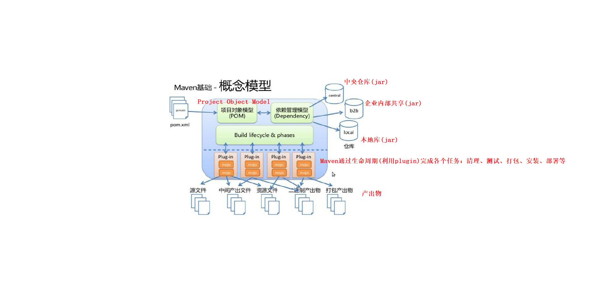
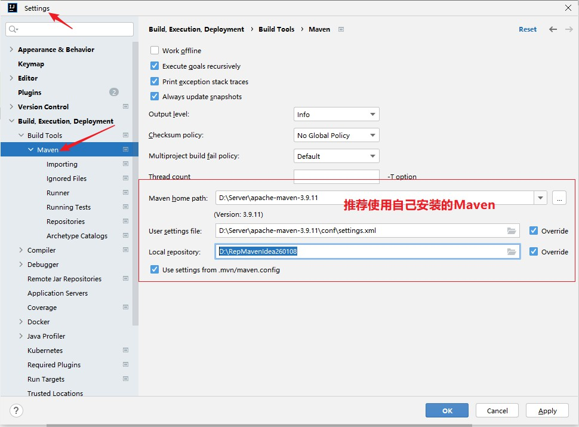
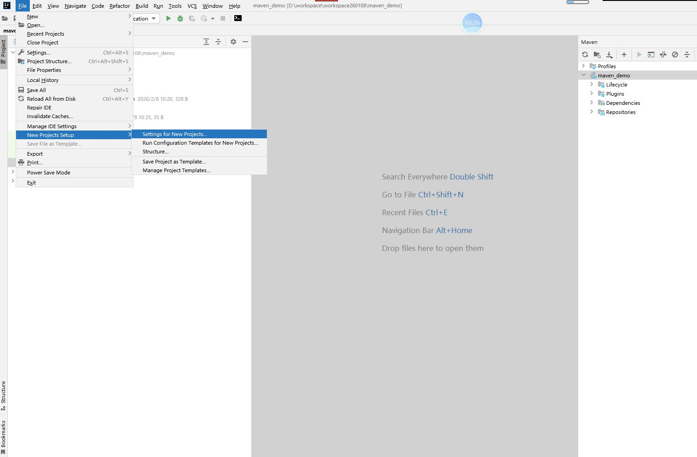
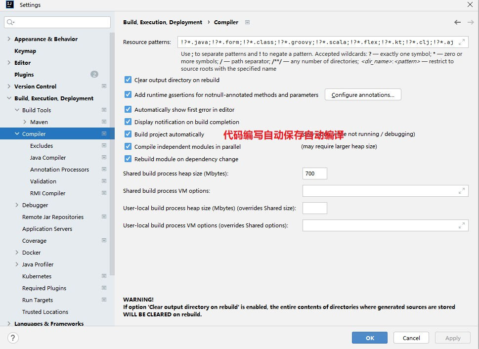
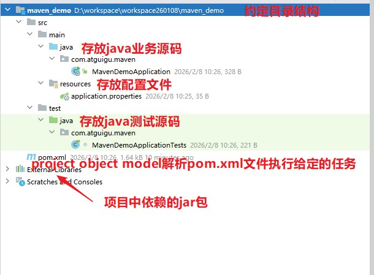
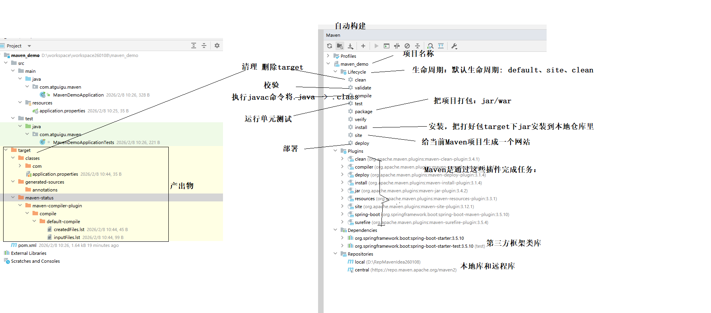
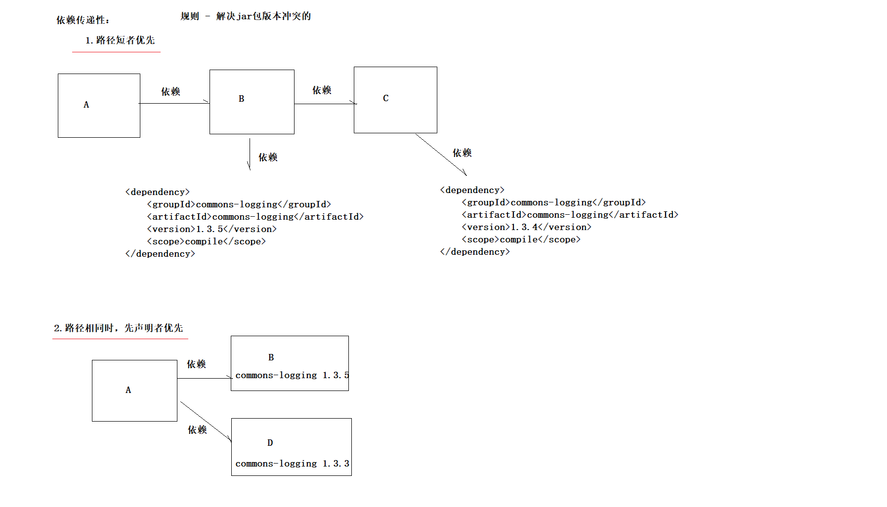

# day01_Maven：Maven

## 课程资料















## 笔记正文

```text
1.Maven是什么？作用？核心？

	是什么？`Maven` 是一款为 Java 项目提供「构建」与「依赖管理」的工具（软件）。
	
	作用？
	
		自动构建
		
			清理 -> 编译 ->  测试 ->  报告 -> 打包 -> 安装 -> 部署
		
		依赖管理
		
			以前需要下载导入很多jar包，会出现jar包之间冲突。
			
			现在maven帮我们管理jar包。
			

		
	好处：使用 Maven 可以自动化完成编译、测试、打包、发布等流程，从而提升开发效率与交付质量。


2.安装与配置

	下载：https://maven.apache.org

		
	安装：
	
			D:\Server\apache-maven-3.9.11\conf\settings.xml
			
			本地库：  <localRepository>D:/RepMavenIdea260108</localRepository>
			
			远程镜像仓库：
				<mirror>
				  <id>alimaven</id>
				  <mirrorOf>central</mirrorOf>
				  <name>aliyun maven</name>
				  <url>http://maven.aliyun.com/nexus/content/groups/public</url>
				</mirror>
		
			JDK版本：
				<profile>
					<id>jdk-17</id>
					<activation>
					  <activeByDefault>true</activeByDefault>
					  <jdk>17</jdk>
					</activation>
					<properties>
					  <maven.compiler.source>17</maven.compiler.source>
					  <maven.compiler.target>17</maven.compiler.target>
					  <maven.compiler.compilerVersion>17</maven.compiler.compilerVersion>
					</properties>
				</profile>

	环境变量：	
		maven依赖JAVA_HOME环境变量。
		JAVA_HOME=C:\Java\jdk-17.0.5
		M2_HOME=D:\Server\apache-maven-3.9.11
		PATH=%JAVA_HOME%\bin;%M2_HOME%\bin
		
		mvn --version 查看版本

	IDEA集成: 
		maven设置，参考截图

3.核心概念 

	packaging项目类型：
	
		<!--Maven项目三种类型，默认jar  [pom,jar,war]-->
		
		<packaging>jar</packaging>
		

	(1) POM模型: Project Object Model
	
		对pom.xml解析解析，然后根据生命周期和相关插件执行任务。
	
	(2) 坐标：GAV （GroupId AtifactId Version）
	
		    <!--坐标：每个项目都有的一个唯一标识
				groupId：公司、部门、事业部
				artifactId：项目会被拆成很多模块。模块化开发。
				version：版本
			-->
			<groupId>com.atguigu</groupId>
			<artifactId>maven_demo</artifactId>
			<version>0.0.1-SNAPSHOT</version>
			
			
			安装和查找：
			
				自动生成仓库路径： com\atguigu\maven_demo\0.0.1-SNAPSHOT
				
					规则：groupId\artifactId\version\artifactId-version.jar
		
		
				案例1：

					依赖于MySQL驱动，得通过坐标进行查找：https://mvnrepository.com/
					
							<!-- Source: https://mvnrepository.com/artifact/mysql/mysql-connector-java -->
							<dependency>
								<groupId>mysql</groupId>
								<artifactId>mysql-connector-java</artifactId>
								<version>8.0.30</version>
								<scope>compile</scope>
							</dependency>

							路径：mysql\mysql-connector-java\8.0.30\mysql-connector-java-8.0.30.jar
				案例2：
				
					        <!-- Source: https://mvnrepository.com/artifact/org.projectlombok/lombok -->
							<dependency>
								<groupId>org.projectlombok</groupId>
								<artifactId>lombok</artifactId>
								<version>1.18.38</version>
								<scope>compile</scope>
							</dependency>
							
							路径：org\projectlombok\lombok\1.18.38\lombok-1.18.38.jar
		
				
						
		
		
	(3) 约定的目录结构
		- `pom.xml`：Maven 项目管理文件，用于描述项目依赖与构建配置等信息  
		- `src/main/java`：项目 Java 源代码（标准 MVC 架构代码）  
		- `src/main/resources`：资源目录（配置文件、静态资源等）  
		- `src/test/java`：测试代码目录  
		- `src/test/resources`：测试资源目录（测试配置等）
	
	(4) 依赖管理 (重点)
	
		依赖范围：

		<!--全局属性定义-->
		<properties>
			<java.version>17</java.version>
			<mysql.version>8.0.30</mysql.version>
		</properties>
		
		
		<dependency>
            <groupId></groupId>
            <artifactId></artifactId>
            <version></version>
            <scope>compile</scope>                依赖范围：compile(默认，可以省略不配)    provided     test    runtime
        </dependency>
		
		依赖范围：
			- compile ：main 目录、test 目录、运行、打包 [默认]
			- provided：main 目录、test 目录            Servlet  不需要参与打包部署，因为Tomcat已经提供了。
			- runtime ：运行、打包                      MySQL驱动
			- test    ：test 目录                       JUnit    不给main代码使用，也不参与打包部署
		
		<dependencies>
			重点是坐标：https://mvnrepository.com/
			
			1.依赖下载失败情况，如何解决？
				依赖坐标下载资源不存在，那么会在仓库中存在很多的垃圾：.lastUpdated
				要么手动一个一个删除；要么使用批处理命令删除：清理maven错误缓存.bat （使用时需要修改下仓库目录）

			2.依赖传递性：
				
				直接依赖
				
				间接依赖

			3.依赖冲突特性：
			
				手动：
					<dependency>
						<groupId>com.atguigu</groupId>
						<artifactId>B</artifactId>
						<version>0.0.1</version>
						<!--排除依赖-->
						<exclusions>
							<exclusion>
								<groupId>commons-logging</groupId>
								<artifactId>commons-logging</artifactId>
							</exclusion>
						</exclusions>
					</dependency>
				
				自动：
					两个规则：
						1.路径短者优先
						2.路径相同时，先声明者优先

			
		面试题：<dependencies>和<dependencyManagement>使用区别？


	(5) 生命周期
	
		- clean: 将target目录删除
		
		- site: 生成项目说明网站
		
		- default: 重点
		
			清理 -> 编译 ->  测试 ->  报告 -> 打包 -> 安装 -> 部署
			
	
	(6) 插件和目标
	
		仓库\org\apache\maven\plugins\
			maven-assembly-plugin
			maven-clean-plugin      清理
			maven-compiler-plugin   编译
			maven-dependency-plugin
			maven-deploy-plugin     部署
			maven-enforcer-plugin
			maven-failsafe-plugin
			maven-help-plugin
			maven-install-plugin    安装
			maven-invoker-plugin
			maven-jar-plugin        打包
			maven-javadoc-plugin
			maven-plugins
			maven-project-info-reports-plugin
			maven-release-plugin
			maven-resources-plugin  资源
			maven-shade-plugin
			maven-site-plugin       生成网站
			maven-source-plugin
			maven-surefire-plugin
			maven-war-plugin

	
	(7) 继承
	
		dependencies(只要声明就下载) : 父模块的dependencies里声明的依赖，子模块直接使用，无需任何声明。
		dependencyManagement(只声明不下载,孩子模块用时才会下载) : 父模块dependencyManagement里声明的依赖，子模块需要声明后才能使用。

		这两个标签声明依赖，都是父模块统计进行版本管理。

		
	(8) 聚合
	
		当前项目必须是pom类型
	
		<!--聚合： 一键操作
			例如：对父模块进行编译，所有被聚合模块都跟着编译。
		-->
		<modules>
			<module>A</module>
			<module>B</module>
			<module>C</module>
			<module>D</module>
			<module>E</module><!--不是继承关系也能被聚合-->
		</modules>

	
	(9) 仓库
	
		- 本地仓库：
			
			设置：settings.xml 
				<localRepository>D:/RepMavenIdea260108</localRepository>
				
		- 中央仓库：
			https://mvnrepository.com/          查找坐标网站
			
			https://repo.maven.apache.org      下载网址

		- 远程镜像仓库：国内     是中央仓库副本
		
			<mirror>
			  <id>alimaven</id>
			  <mirrorOf>central</mirrorOf>
			  <name>aliyun maven</name>
			  <url>http://maven.aliyun.com/nexus/content/groups/public</url>
			</mirror>
			
		仓库里都有啥？大概分三类
		
			org\apache\maven\plugins    				放的都是Maven的插件
			
			com\atguigu\                				存放自己项目打包后安装模块
			
			剩余的，例如mysql\mysql-connector-java      都属于第三方框架或组件
		
		共享项目时，无需共享本地库。

	注意事项：
	
		1.避免循环依赖
	
	
4.实战


5.面试题？

   1) dependencies和dependencyManagement使用区别？
   
   2) 如何解决依赖冲突问题？
```
