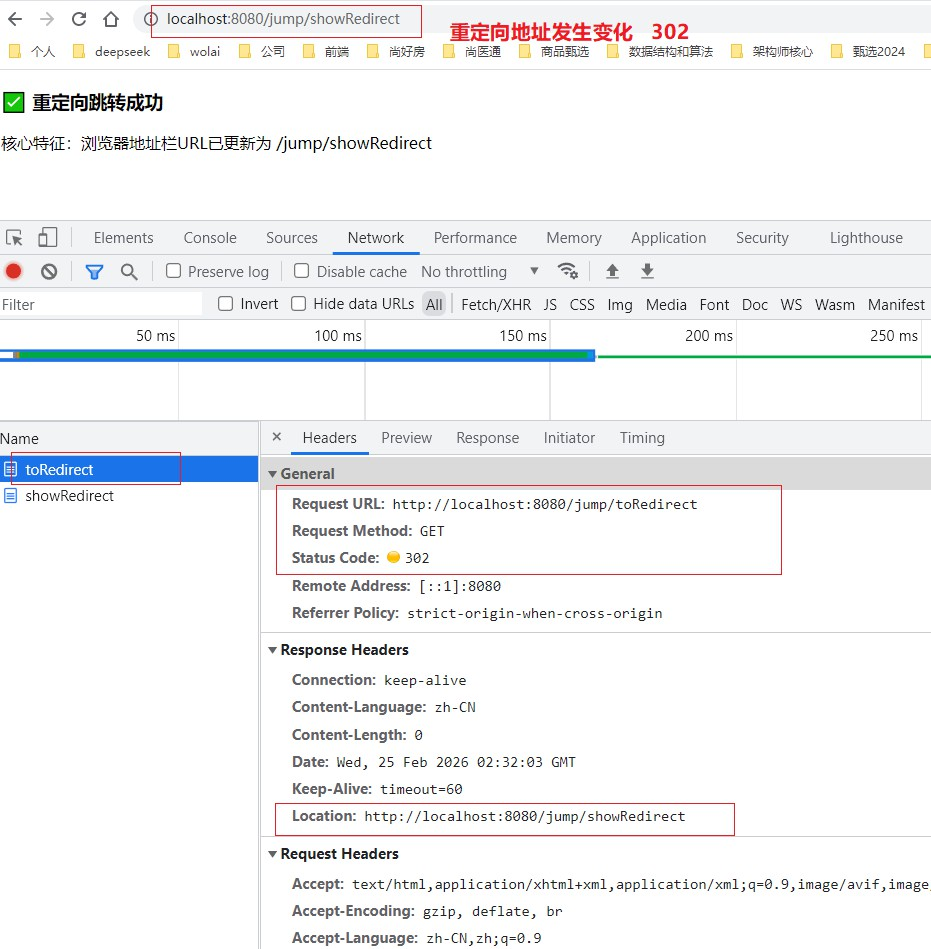

# day04_SpringMVC：SpringMVC 进阶

## 课程资料



## 笔记正文

```text
1.课程介绍

	Web与框架学习路线：
	
	SpringBoot -> SpringMVC -> MyBatis -> MyBatisPlus -> Spring高级 -> SpringBoot高级

2.web核心概念

	Web项目：基于网络通信，由客户端和服务器组成的程序！客户端一般用于展示和数据收集，服务端用于业务逻辑及数据处理！


	客户端与服务器 
	
		C/S    client/server
		
			手机端APP、微信小程序、AI智能体    |   Tomcat
		

		B/S    browser/server
		
			PC浏览器   |   Tomcat
		
	
	静态资源 与 动态资源
	
		
		静态资源: html css  js   image   mp3   mp4          不变的内容
		
		
		动态资源: 根据搜索条件到数据库里动态查找数据。进行业务逻辑处理。
		

	 
	通信规则：http协议简介

	
	服务器软件：
	
		Tomcat   JBoss


3.Spring与SpringBoot 介绍


	Spring 2003年
	
		核心功能：IOC(控制反转-对Bean生命周期进行管理)和AOP(将非业务代码(事务、日志、数据校验)和业务代码分离-解耦)
	
	SpringBoot  2013年
	
		SpringBoot是为了简化Spring而生的。
		
		好处：
			提供大量场景启动器
			内置Tomcat
			简化配置
			监控健康
			....

4.SpringWeb项目(快速开发体验)


5.http协议

	(1) HTTP (超文本传输协议HyperText Transfer Protocol)
	
		是应用层的面向对象协议，设计目的是确保客户端与服务器之间的通信，是互联网上最常用的协议之一。
		
			核心：
				通信规则
				请求报文和响应报文
	
	(2) 通信流程：
		- **建立连接**：客户端与服务器之间建立连接。在传统的 HTTP 中，这是基于 TCP/IP 协议的。最近的 HTTP/2 和 HTTP/3 则使用了更先进的传输层协议，例如基于 TCP 的二进制协议（HTTP/2）或基于 UDP 的 QUIC 协议（HTTP/3）。
		- **发送请求**：客户端向服务器发送请求，请求中包含要访问的资源的 URL、请求方法（GET、POST、PUT、DELETE 等）、请求头（例如，Accept、User-Agent）以及可选的请求体（对于 POST 或 PUT 请求）。
		- **处理请求**：服务器接收到请求后，根据请求中的信息找到相应的资源，执行相应的处理操作。这可能涉及从数据库中检索数据、生成动态内容或者简单地返回静态文件。**（服务端）**
		- **发送响应**：服务器将处理后的结果封装在响应中，并将其发送回客户端。响应包含状态码（用于指示请求的成功或失败）、响应头（例如，Content-Type、Content-Length）以及可选的响应体（例如，HTML 页面、图像数据）。
		- **关闭连接**：在完成请求-响应周期后，客户端和服务器之间的连接可以被关闭，除非使用了持久连接（如 HTTP/1.1 中的 keep-alive）。

	(3) 请求数据格式
		请求行：请求方法 [空格] URL [空格] 协议版本 [回车符][换行符]
		请求头部：头部字段名 [:] 值 [回车符][换行符]
		请求头部：头部字段名 [:] 值 [回车符][换行符]
		请求头部：头部字段名 [:] 值 [回车符][换行符]
		.... （请求头有多组）
		空行：[回车符][换行符]
		请求体：（客户端传递的数据）

	(4) 响应数据格式
	
		状态行：协议版本 [空格] 状态码 [空格] 状态描述 [回车符][换行符]
		响应头部：头部字段名 [:] 值 [回车符][换行符]
		响应头部：头部字段名 [:] 值 [回车符][换行符]
		响应头部：头部字段名 [:] 值 [回车符][换行符]....（响应头有多组）
		空行：[回车符][换行符]
		响应体：（服务器返回的数据）

	(5) 请求方法：
	
		get: 查询
		
			没有请求体。数据放url后面传输。长度有限制(不要大于2Kb)。不安全。是幂等。
		
		post: 添加
		
			有请求体。没有大小限制。支持上传文件。不是幂等。安全。
		
		put: 修改
			有请求体。没有大小限制。支持上传文件。是幂等。安全。
		
		delete: 删除
			没有请求体。数据放url后面传输。长度有限制(不要大于2Kb)。不安全。是幂等。
		
		...

	
	(1) 请求状态码：
	
		1** 信息
		
		2** 成功
		
			200 成功
		
		3** 重定向
		
			302 重定向
		
		4** 客户端错误
		
			400 参数错误
			403 无权访问
			404 资源找不到，一般路径错误
			405 请求方法不对
			
		
		5** 服务端错误
			500 服务器端有异常
			502 网关错误
			503 服务不可用

	
6.SpringMVC与SpringBoot集成

	
7.核心注解：

	@SpringBootApplication
		声明一个SpringBoot应用主程序。

	@Controller  声明一个控制器组件

	

	@RestController
		声明一个控制器组件。并纳入IOC容器里被管理。
		组合注解： @Controller + @ResponseBody
		
	@RequestMapping
		声明一个路径映射。用于客户端的访问
		
		精确匹配：
			@RequestMapping(value = {"/user/login"})
			@RequestMapping(value = {"/user/register"})
		模糊匹配：
			通过 `*` 或 `**` 通配符匹配多个相似路径，适用于批量映射场景：
				- `/*`：匹配**单层**任意字符串（仅一级路径）
				- `/**`：匹配**任意层**任意字符串（多级路径）
			例如：
				@RequestMapping("/product/**")   匹配多级路径
				@RequestMapping("/product/*")    匹配一级路径
				
		注解位置：
			注解放在类上和方法上时，父路径+子路径=完整路径
	
		请求方式限制
			@RequestMapping(value = "list", method = RequestMethod.GET)  //只能发送get请求
			
			@RequestMapping(value = "list", method = {RequestMethod.GET,RequestMethod.POST}) //支持get或post,否则：405 Method Not Allowed
	
			请求方法：
				public enum RequestMethod {
				  GET, HEAD, POST, PUT, PATCH, DELETE, OPTIONS, TRACE
				}
	
		简便注解：
			@GetMapping  只支持get请求	
			@PostMapping  只支持gpost请求
			@PutMapping   只支持put请求
			@DeleteMapping  只支持delete请求
			
				关键提醒：快捷注解**仅能标注在方法上**，无法用于类级别；类级别仍需使用 `@RequestMapping` 配置通用前缀。
	
		映射冲突：
			请求方法和请求路径不同同时一致。否则声明上会出现冲突。
	
	@RequestParam(value="Phone",required = true,defaultValue = "13199999999")
		value用来映射参数名称。当请求参数名称与方法参数名称不一致时，可以用于接收参数。
		required = true 表示必须传递请求参数。400 Bad Request
		defaultValue = ""  用于设置默认
		
		
		一个参数名多个参数值：
			    //   http://localhost:8080/user/hobby?hbs=吃&hbs=喝&hbs=玩
				@GetMapping("hobby") //只支持get请求
				public String hobby(String[] hbs) {  //直接定义数组即可
					System.out.println("hbs = " + hbs);
					return "-----hbs="+hbs;
				}

				@GetMapping("hobby") //只支持get请求
				public String hobby(@RequestParam List<String> hbs) {  //必须增加@RequestParam
					System.out.println("hbs = " + hbs);
					return "-----hbs="+hbs;
				}

	@PathVariable 路径接收参数	
	
		@RequestMapping(value="{id}")
		public SysUser getSysUserById(@PathVariable Long id)  //路径占位符名称和方法参数名称【一样】，增加注解即可

		@RequestMapping(value="{userId}")
		public SysUser getSysUserById(@PathVariable("userId") Long id)  //路径占位符名称和方法参数名称【不一样】，需要通过注解value起别名，与占位符名称一致。
	
		@PathVariable(required = true)   //站位付参数必须传递
	
	


	@RequestBody  获取请求体数据。post和put带有请求体的。get和delete是没有请求体的。
		注意：delete在http协议中表示有请求体。但是浏览器或框架一般不支持。
	
	


	@ResponseBody  响应体。数据要以响应体方式返回。
	
	
	@RequestHeader 用于接收请求头
		@RequestHeader(value="Content-Type",required=true) 
	
	

8.JSON （JavaScript Object Notation）

	优点：
		解构紧凑，易理解，易解析，传递速度快，跨语言。


	1) 表示单个对象	
		{
			"id": 1,
			"username": "zhangsan",
			"age": 22
		}
		
	2) 表示多个对象,用数组表示
	
		[
			{
				"id": 1,
				"username": "zhangsan",
				"age": 22
			},
			{
				"id": 2,
				"username": "lisi",
				"age": 23
			},
			{
				"id": 3,
				"username": "wangwu",
				"age": 33
			},
		]
	3) 嵌套对象
	
		{
			"id": 1,
			"username": "于谦",
			"age": 55,
			"dept" : {
				"deptId":1,
				"deptName": "德云社"
			},
			"hobby": ["抽烟","喝酒","烫头"]
		}	


9.Postman工具

	客户端工具，用于接口测试。


10.HttpServletRequest和HttpServletResponse

	1) HttpServletRequest常用方法：
	
		//使用原生的Servlet API  可以获取请求数据：  请求参数，请求头，请求体，请求方法，请求路径，客户端ip地址等
		@RequestMapping("testRequest")
		public String testRequest(HttpServletRequest request){
			String username = request.getParameter("username");  //  http://localhost:8080/user/testRequest?username=zhangsan
			String age = request.getParameter("age");  //  http://localhost:8080/user/testRequest?username=zhangsan&age=22

			String token = request.getHeader("token");
			String contentType = request.getHeader("Content-Type");


			Cookie[] cookies = request.getCookies();


			String remoteAddr = request.getRemoteAddr(); //获取客户端地址
			String localAddr = request.getLocalAddr(); //获取服务器端地址

			StringBuffer requestURL = request.getRequestURL(); //完整路径
			String requestURI = request.getRequestURI(); //端口号后面的

			HttpSession session = request.getSession();

			String queryString = request.getQueryString(); //获取url 问号后面参数
			String method = request.getMethod(); // get/post/put/delete


			return "ok";
		}
		
		

11.转发 & 重定向


	转发：
		服务器内部资源跳转
		1次请求
		浏览器地址不变
		
	重定向：
		不是必须服务器内部资源跳转，也可以是外站
		2次请求
		浏览器地址变了
	
	
	前后端分离模式：
		后端不负责页面跳转。直接将数据返回给前端。前端负载页面跳转。
	
	混合模式：(页面和代码在一个项目里)
		后端需要采用转发或重定向跳转页面。
	
	

12.共享域 

	用来共享数据。因为转发或重定向都需要跳转多个资源来处理同一个请求。
	
	A -> B -> C  
	
	A、B、C 都需要同一个数据时，如何获取？
	
	
	采用web开发共享域：有3个
	
	request域：HttpServletRequest
	
		在同一次请求中有效
	
	session域：HttpSession
	
		在同一个客户端(登录->注销)，多次请求中有效
		
	application域：ServletContext
	
		在不同客户端，不同的请求中都有效
		整个应用唯一的，大家可以共享。
		
	推荐使用顺序（范围从小->大）：  request > session > application 
	
	后期：分布式系统开发，集群环境下数据共享。这3个域都不用。会采用redis做数据共享。

	
	客户端共享数据技术：Cookie [不安全,客户端,数据小,容易丢(浏览器清理缓存)]
	服务器共享数据技术：request、session、application [安全,服务器端,数据量没有限制]
	
	cookie(客户端)和session(服务器端)都用用于跟踪用户状态。(你是谁)
	


13.模板页面

	什么静态资源：html、css、js、图片、视频、音频等

	存放位置：SpringBoot框架默认规则
	
		- `classpath:/META-INF/resources/`
		- `classpath:/resources/`
		- `classpath:/static/`（最常用）
		- `classpath:/public
		
		可以修改位置：spring.web.resources.static-locations=classpath:/my-static/


14.Result类

	优化响应格式设置通用返回结构（Result类）
	
	

15.扩展ResponseEntity(了解)


16.RESTFul

	RESTful 接口设计的 4 个核心原则，缺一不可：

		1. **资源唯一标识**：每个 URL（URI）只代表一种 “资源”（比如用户、商品），URL 中只包含**名词**（如`/user`），不包含动词（如`/getUser`）；
		2. **HTTP 方法表语义**：客户端通过 GET/POST/PUT/DELETE 这 4 个 HTTP 动词，对服务端的资源做 “增删改查” 操作，而非在 URL 中体现操作：
		   - GET：获取资源（查询）；
		   - POST：新建资源（新增）；
		   - PUT：更新资源（修改）；
		   - DELETE：删除资源（删除）；
		3. **数据格式标准化**：资源的传递 / 返回格式用 JSON（主流），前后端数据交互格式统一；
		4. **无状态交互**：客户端的每次请求都包含服务端处理该请求的所有信息，服务端无需保存 “会话状态”（比如用户登录状态），降低系统复杂度。


17.SpringMVC高级扩展

	17.1 异常处理
	
	17.2 参数校验
	
	17.3 拦截器
```
